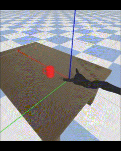

# Robotic Grasping 

This reinforcement learning PyBullet project aims to grasp a randomly initialized mug through DQN utilizing a Kinova ultra lightweight robotic arm. 

## Installation steps

1. Clone the anaconda environment.
```
conda env create -f environment.yml
```
2. Activate the environment.
```
conda activate robotic_grasping_mug
```
3. Verify the installation.
```
conda env list
```

## Structure of this project

This project is structured in three subfolders. To utilize their functions, open each folder individually. 

### Phase1

Simplified grasping environment with smaller actions space and fewer mug positions. Learn DQN with:
```
learnDQN_phase1.py
```


After training, test the learned policy with:
```
testDQN_phase1.py
```

### Phase2

More complex grasping environment with an additional grasp action and more mug positions. Learn DQN with:
```
learnDQN_phase2.py
```


After training, test the learned policy with:
```
testDQN_phase1.py
```


### Plots

Collection of Python scripts for creating and saving figures, plots and videos.